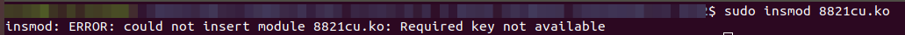

# rtl8821cu

Drivers for the rtl8821cu chipset for wireless adapters (D-Link DWA-171 rev C1)

## Install driver
### requirement
    * kernel header

### compile the driver
```
> cd driver
> make
```
### test the driver (require cfg80211 loaded in system)
```
> insmod 8821cu.ko
```
### install driver
```
> sudo make install
```
## auto switch from DISK mode to NIC mode
### requirement (test with ubuntu 18.04):
    1. usb-modeswitch usb-modeswitch-data
```
    > apt install usb-modeswitch usb-modeswitch-data
```
    2. udev
```
    > apt install udev
```

### install usb-modeswitch setting files
```
> cd usbswitch
> sudo make install
```
## UEFI Secure Boot - (boot the kernel with signed)
 if insmod the module it shows error of "Required key not available", you are using a kernel which is signed
 Only signed module can be use in this condition.

 

1. Create signing keys

```
    openssl req -new -x509 -newkey rsa:2048 -keyout MOK.priv -outform DER -out MOK.der -nodes -days 36500 -subj "/CN=Descriptive name/"
```
2. Sign the module

```
    sudo /usr/src/linux-headers-$(uname -r)/scripts/sign-file sha256 ./MOK.priv ./MOK.der /path/to/module
```
3. Register the keys to Secure Boot

```
    sudo mokutil --import MOK.der
```
​		Supply a password for later use after reboot

4. Reboot and follow instructions to Enroll MOK (Machine Owner Key).
   Here's a sample with pictures. The system will reboot one more time.
5. Confirm the key is enrolled

```
mokutil --test-key MOK.der
```

